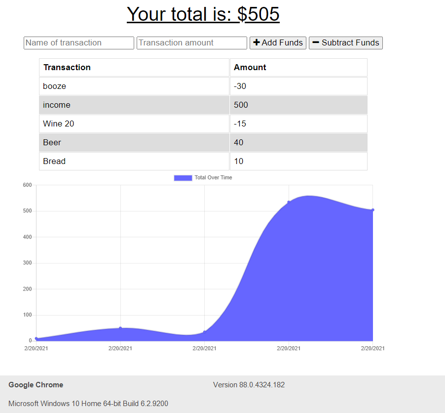

# Online and Offline Budget Tracker
## Description

This applicaiton will allow a user to manage their money with a budget tracker that is functional with our without a connection. 

The user is able to add expenses and deposits to their budget tracker. When they enter a transaction offline, it will populate once they are brought back online.

## User Story
AS AN avid traveller
I WANT to be able to track my withdrawals and deposits with or without a data/internet connection
SO THAT my account balance is accurate when I am traveling

## Business Context

Giving users a fast and easy way to track their money is important, but allowing them to access that information anytime is even more important. Having offline functionality is paramount to our applications success.

## Screenshot

## Tools used

* HTML, CSS, JS
* Node.js
* Express
* MondoDB
* Mongoose

## Author

Pieter Boerma

## Submission on BCS

* You are required to submit the following:

  * https://onofflinebudgettracker.herokuapp.com/

  * https://github.com/pboerma/on_offlinetracker

